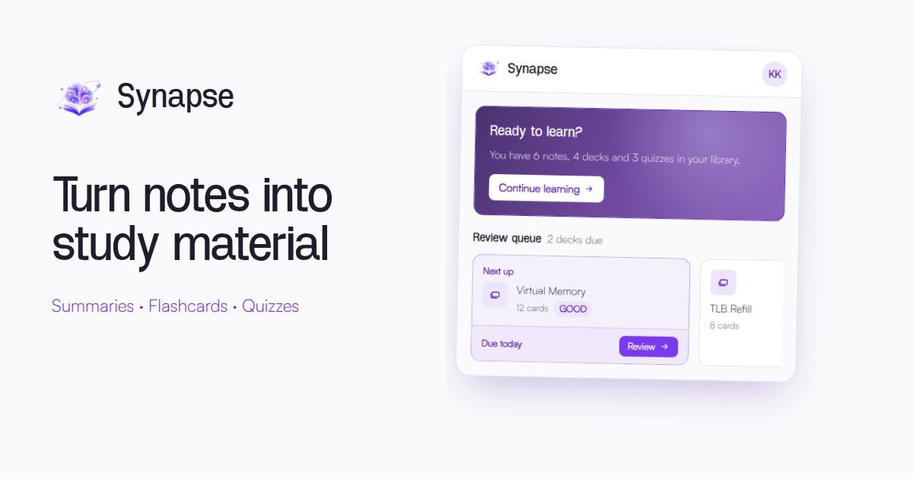
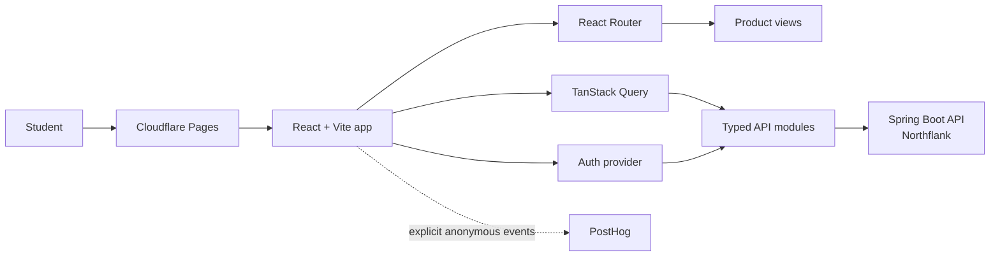

# Synapse Frontend ✨

> The production web experience for [Synapse](https://studysynapse.app) — a full-stack study platform that turns uploaded notes into structured summaries, flashcards, quizzes, review schedules, and meaningful progress insights.

[](https://react.dev/)
[](https://www.typescriptlang.org/)
[](https://vite.dev/)
[](https://tailwindcss.com/)
[](https://pages.cloudflare.com/)

**[Open the live app](https://studysynapse.app)** · **[View the backend repository](https://github.com/maegiko/synapse-backend)** · **[Check API health](https://api.studysynapse.app/actuator/health)**



Synapse turns the full study workflow into one focused interface. Learners can upload course material, review an AI-generated summary, build flashcards and quizzes, organise a growing library, practise with spaced repetition, and understand their progress without leaving the app.

## The Experience 🌟

### Turn notes into something useful

- Drag and drop PDF, DOCX, TXT, or Markdown files up to 10 MB
- Follow clear generation states while the backend extracts and summarises the material
- Read structured overviews, key points, concepts, and important terms
- Generate ten-card flashcard decks or ten-question quizzes from any saved note
- Edit generated notes, cards, questions, answers, titles, descriptions, and difficulty

### Practise with purpose

- Review flashcards in saved order or shuffle them for a fresh run
- Flip cards with the keyboard and move through a deck with the arrow keys
- Rate completed reviews as `AGAIN`, `HARD`, `GOOD`, or `EASY`
- See due and overdue decks in a personal review queue
- Play quizzes, save scores and study duration, and revisit attempt history
- Celebrate qualifying study activity with streak feedback

### Keep a real study library

- Browse notes, decks, and quizzes in one searchable, paginated library
- Filter by resource type or show only pinned material
- Pin important resources so they stay at the top
- Create study groups that combine related notes, decks, and quizzes
- Move or remove material without changing ownership or deleting the original resource
- Return to the right place through context-aware navigation trails

### Understand what is improving

- Compare progress across 7, 30, 90, and 365-day windows
- See study time, active days, completed sessions, and quiz performance
- Inspect flashcard retention, rating distribution, deck mastery, and due forecasts
- Follow quiz averages, best results, improvement, and recent attempts
- View current and longest streaks in the account's own time zone

## Product Flow 🔄

1. **Upload** a note from the dashboard.
2. **Review** the generated summary and refine it if needed.
3. **Generate** a flashcard deck, a quiz, or both.
4. **Practise** with keyboard-friendly deck and quiz players.
5. **Organise** useful material with pins and study groups.
6. **Improve** using review schedules, streaks, scores, and analytics.

## Architecture 🏗️



The application is organised around pages, reusable components, typed API modules, and focused client-side libraries. React Router owns navigation, TanStack Query owns server state, and the authentication provider coordinates the in-memory access token with the backend's rotating refresh cookie.

## Frontend Engineering Highlights 🔍

- **Safe session handling** — access tokens stay in memory rather than local storage. On startup, the app attempts one cookie-backed refresh and then loads the current profile.
- **Single-flight token rotation** — concurrent `401` responses share one refresh request because the backend rotates refresh tokens on every use. Each failed API request is retried at most once.
- **Identity-safe caching** — query data is cleared whenever a session ends or a different account is adopted, preventing one user's cached resources from appearing for another.
- **Purposeful server state** — TanStack Query provides shared caching, request deduplication, paginated searches, mutation invalidation, loading states, and controlled retry behaviour.
- **Resilient failure states** — network errors, API responses, missing resources, expired sessions, generation failures, and unexpected render errors each have a deliberate UI path.
- **Privacy-conscious analytics** — PostHog records six explicitly named product events without user or content properties. Autocapture, person profiles, heatmaps, exception capture, and session replay are disabled.
- **Accessible interaction** — the interface includes skip links, visible keyboard focus, semantic controls, keyboard deck playback, accessible dialogs, and reduced-motion handling.
- **Theme without a flash** — light and dark themes are applied before React's first paint, saved locally, and reflected in the browser theme colour.
- **Responsive by design** — landing, dashboard, library, players, forms, dialogs, and analytics adapt from narrow mobile screens to wide desktop layouts.

## Tech Stack 🛠️

| Area | Technology |
| --- | --- |
| UI | React 19, TypeScript 6 |
| Build tooling | Vite 8 |
| Styling | Tailwind CSS 4, custom design tokens, local and web fonts |
| Navigation | React Router 7 |
| Server state | TanStack Query 5 |
| Product analytics | PostHog with explicit, anonymous events |
| Quality | ESLint 10, TypeScript project builds |
| Hosting | Cloudflare Pages |
| API | Spring Boot backend hosted on Northflank |

## Run Locally 🚀

### Requirements

- Node.js `20.19+` or `22.12+`
- npm
- A running [Synapse backend](https://github.com/maegiko/synapse-backend) for real account and study flows

### 1. Clone and install

```bash
git clone https://github.com/maegiko/synapse-frontend.git
cd synapse-frontend
npm ci
```

### 2. Configure the API

```bash
cp .env.example .env
```

The default development configuration points to the local backend:

```properties
VITE_API_BASE_URL=http://localhost:8080
VITE_POSTHOG_PROJECT_TOKEN=
VITE_POSTHOG_HOST=https://us.i.posthog.com
```

Product analytics is optional. Leaving the project token empty disables PostHog completely during local development.

### 3. Start the app

```bash
npm run dev
```

Open `http://localhost:5173`. The backend's development CORS configuration already allows this origin.

To exercise registration, verification, password recovery, note generation, and the complete study flow, configure the backend's database, JWT, Groq, and Resend variables as described in its [README](https://github.com/maegiko/synapse-backend#run-locally-).

## Available Scripts 📜

| Command | Purpose |
| --- | --- |
| `npm run dev` | Start the Vite development server with hot module replacement |
| `npm run build` | Type-check the project and create the production bundle in `dist/` |
| `npm run lint` | Run ESLint across the project |
| `npm run preview` | Serve the production bundle locally for a final browser check |

The standard quality gate is:

```bash
npm run lint
npm run build
```

## Configuration ⚙️

| Variable | Required | Purpose |
| --- | --- | --- |
| `VITE_API_BASE_URL` | No | Backend origin; defaults to `http://localhost:8080` |
| `VITE_POSTHOG_PROJECT_TOKEN` | No | Public PostHog project token; analytics is disabled when absent |
| `VITE_POSTHOG_HOST` | With token | PostHog ingestion host |

Every `VITE_` variable is embedded into the browser bundle and is therefore public. The PostHog project token is designed to be client-visible; private API keys and backend credentials must never be placed in frontend environment variables.

## Routes 🧭

### Public account flow

| Route | Purpose |
| --- | --- |
| `/` | Product landing page |
| `/login` | Sign into a verified account |
| `/register` | Create an account and request verification |
| `/verify-email` | Confirm registration or an email change from an emailed token |
| `/forgot-password` | Request a password-reset link |
| `/reset-password` | Set a new password from a reset token |

### Authenticated experience

| Route | Purpose |
| --- | --- |
| `/dashboard` | Personal overview, streak, review queue, groups, and recent resources |
| `/library` | Search and filter notes, decks, quizzes, and pinned material |
| `/notes/new` | Upload and summarise a note |
| `/notes/:noteId` | Read and edit a structured note |
| `/flashcards/new` | Generate a deck from a saved note |
| `/flashcards/:deckId` | View and edit a deck and its cards |
| `/flashcards/:deckId/play` | Complete a saved-order or shuffled review session |
| `/quiz/new` | Generate a quiz from a saved note |
| `/quiz/:quizId` | View and edit a quiz |
| `/quiz/:quizId/play` | Complete and score a quiz attempt |
| `/quiz/:quizId/scores` | Review that quiz's attempt history |
| `/groups` | Search, create, and manage study groups |
| `/groups/:groupId` | Work with the resources inside one group |
| `/analytics` | Explore study and performance analytics |
| `/profile` | Update profile, time zone, email, and password |

Guest routes redirect signed-in users to the dashboard, while protected routes wait for session restoration and redirect anonymous visitors to login. Unknown paths receive a dedicated not-found experience.

## API Integration 🔌

The browser communicates with the [Synapse Spring Boot API](https://github.com/maegiko/synapse-backend) through domain-focused modules in `src/api`:

```text
src/api
├── auth.ts        # Registration, login, refresh, verification, and recovery
├── client.ts      # Fetch wrapper, errors, cookie handling, and refresh-and-retry
├── flashcards.ts  # Deck CRUD, card editing, review queue, and scheduling
├── groups.ts      # Group CRUD and resource membership
├── notes.ts       # Multipart upload, summaries, listing, and editing
├── quiz.ts        # Quiz generation, editing, play results, and score history
└── user.ts        # Profile, streak, email change, and analytics
```

Authenticated requests attach the current bearer token. Authentication endpoints opt into credentials so the browser can send the backend's `HttpOnly` refresh cookie. Domain errors are normalised into readable messages, and rate-limit responses retain the server's `Retry-After` value for countdown feedback.

## Analytics and Privacy 🕊️

Product analytics is intentionally narrower than study analytics:

- **Study analytics** comes from the authenticated backend and is shown only to the account that created the activity.
- **Product analytics** optionally sends six anonymous lifecycle events to PostHog: registration submitted, email verified, login succeeded, note created, deck generated, and quiz generated.

Synapse attaches no names, email addresses, note text, questions, answers, or titles to these events. PostHog may still add its standard anonymous browser context. Session recording and automatic interaction capture remain disabled in code.

## Deployment 🚢

The production site is deployed to Cloudflare Pages from the `main` branch.

| Cloudflare Pages setting | Value |
| --- | --- |
| Build command | `npm run build` |
| Build output directory | `dist` |
| Production domain | `studysynapse.app` |
| API URL | `https://api.studysynapse.app` |

Configure these production variables in the Cloudflare Pages project:

```properties
VITE_API_BASE_URL=https://api.studysynapse.app
VITE_POSTHOG_PROJECT_TOKEN=<public-project-token>
VITE_POSTHOG_HOST=https://us.i.posthog.com
```

The backend must allow the exact frontend origin in its CORS configuration. Cloudflare handles TLS and serves the static Vite bundle, while React Router handles navigation inside the application.

The repository also includes canonical metadata, Open Graph and Twitter previews, structured `WebApplication` data, a sitemap, robots rules, favicons, and a web manifest for polished sharing and discovery.

## Project Structure 🧱

```text
src
├── api          # Typed backend modules and the shared fetch client
├── assets       # Product illustrations, logo, and fonts
├── auth         # Session context and authentication state
├── components   # Shared navigation, dialogs, cards, controls, and feedback
├── dev          # Development-only error-boundary route
├── lib          # Queries, mutations, formatting, theme, analytics, and utilities
├── pages        # Route-level product experiences
├── App.tsx      # Router and route guards
├── index.css    # Tailwind theme, tokens, motion, and interaction styles
└── main.tsx     # Application providers and the top-level error boundary

public           # Social preview, icons, manifest, sitemap, robots, and flags
```

## Scope and Trade-offs 🧭

- The app requires a modern JavaScript-enabled browser and a reachable backend; it is not an offline study client.
- Uploaded material supports PDF, DOCX, TXT, and Markdown. Scanned images and legacy `.doc` files need conversion before upload.
- Generation time and output quality depend on the configured AI provider. The interface communicates that work clearly and keeps generated material editable.
- Access tokens deliberately remain in memory, so a full page load restores the session through the refresh cookie before protected content appears.
- Product analytics is optional and browser-side blockers may prevent it without affecting any study feature.

---

Synapse was designed and built as one cohesive product: responsive interface, secure session lifecycle, typed API integration, AI-assisted study flows, spaced repetition, progress analytics, thoughtful error states, privacy-conscious telemetry, and production deployment.
